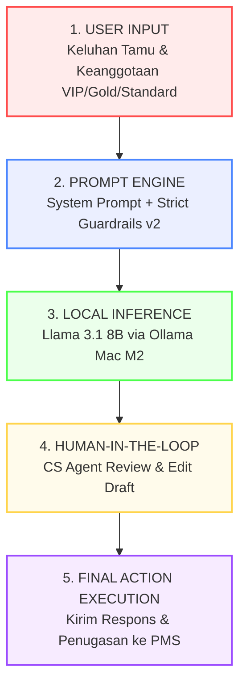

# 🌸 Sakura CS Assistant: Local AI-Powered Customer Service Triage & Escalation

[](https://www.python.org/)
[](https://streamlit.io/)
[](https://ollama.com/)

**Sakura CS Assistant** adalah sebuah alat atau *Decision Support System* (Sistem Pendukung Keputusan) berbasis kecerdasan buatan lokal (Local AI) yang dirancang khusus untuk mengelola penumpukan keluhan tamu di **Hotel Sakura Kyoto** selama musim puncak liburan (*Hanami peak season*). 

Proyek ini dibuat untuk memenuhi **Ujian Akhir Semester (UAS)** mata kuliah *Artificial Intelligence*.

---

## Identitas Mahasiswa
- **Nama:** Siwi Forestry
- **NIM:** 24120310008
- **Kelas:** Profesional
- **Program Studi:** Computer Science
- **Mata Kuliah:** Artificial Intelligence
- **Dosen Pengampu:** Haikal Shiddiq, S.Kom., M.T.

---

## Fitur Utama
- **Triage Otomatis:** Mengklasifikasikan tingkat urgensi keluhan (High, Medium, Low) berdasarkan isi keluhan dan kategori keanggotaan tamu (VIP, Gold, Standard) secara instan.
- **Eskalasi Divisi Tepat Sasaran:** Merekomendasikan divisi internal hotel yang wajib menangani masalah (misalnya: *Front Office, Housekeeping, Maintenance, IT Support, Finance*)[cite: 2].
- **Draf Balasan Empatis Berstandar *Omotenashi*:** Menghasilkan draf tanggapan otomatis dalam Bahasa Indonesia yang ramah, taktis, dan aman[cite: 2].
- **Security Guardrails Terintegrasi:** Sistem diproteksi agar **tidak memberikan janji pengembalian uang (*refund*)** secara otomatis guna mencegah kerugian finansial hotel[cite: 2].
- **100% Privasi Terjamin (Local Inference):** Menggunakan model LLM yang berjalan lokal pada perangkat tanpa mengirim data keluhan tamu ke server pihak ketiga (cloud)[cite: 2].
- **Human-in-the-Loop:** Menyajikan antarmuka di mana staf CS manusia dapat meninjau, menyunting, dan menyetujui respons sebelum dikirimkan ke tamu[cite: 2].

---

## Arsitektur Sistem



---

## Spesifikasi Teknologi & Hardware
- **Model Utama:** `Llama-3.1-8B-Instruct` (via Ollama)
- **Framework UI:** Streamlit
- **Bahasa Pemrograman:** Python 3.10+
- **Hardware Pengujian:** MacBook Air M2 (Unified Memory)

---

## Panduan Instalasi & Menjalankan Aplikasi

Pastikan Anda telah memasang **Python** dan **Ollama** di perangkat Anda sebelum memulai.

### 1. Unduh Model di Ollama
Jalankan perintah ini di Terminal Anda untuk mengunduh model Llama 3.1:
```bash
ollama run llama3.1

### 2. Klon Repositori ini
```bash
git clone [https://github.com/siwiforestry/sakura-cs-assistant.git](https://github.com/siwiforestry/sakura-cs-assistant.git)
cd sakura-cs-assistant

### 3. Buat dan Aktifkan Virtual Environment
```bash
# Membuat Virtual Environment
python3 -m venv venv

# Mengaktifkan di macOS
source venv/bin/activate

### 4. Pasang Dependensi
```bash
pip install streamlit ollama matplotlib

### 5. Jalankan Aplikasi
```bash
streamlit run app.py

Aplikasi web otomatis akan terbuka di peramban (browser) Anda pada alamat `http://localhost:8501`

## Struktur Direktori
sakura-cs-assistant/
├── .gitignore               # Daftar berkas yang diabaikan oleh Git
├── README.md                # Dokumentasi utama proyek
├── app.py                   # Berkas kode utama aplikasi Streamlit
├── generate_diagram.py      # Skrip Python pembuat diagram arsitektur
├── architecture_diagram.png # Output visualisasi diagram (PNG)
└── architecture_diagram.pdf # Output visualisasi diagram (PDF)

## Responsible AI & Batasan Sistem
- Keamanan Finansial: Instruksi sistem dikunci ketat (prompt guardrails) agar agen AI tidak memiliki otoritas menyetujui refund finansial secara sepihak.
- Batasan Data Real-time: Karena model berjalan lokal tanpa integrasi database dinamis (Real-Time PMS), AI tidak memiliki data ketersediaan kamar terbaru secara instan. Fungsi konfirmasi teknis tetap diverifikasi oleh staf manusia (Human-in-the-loop).